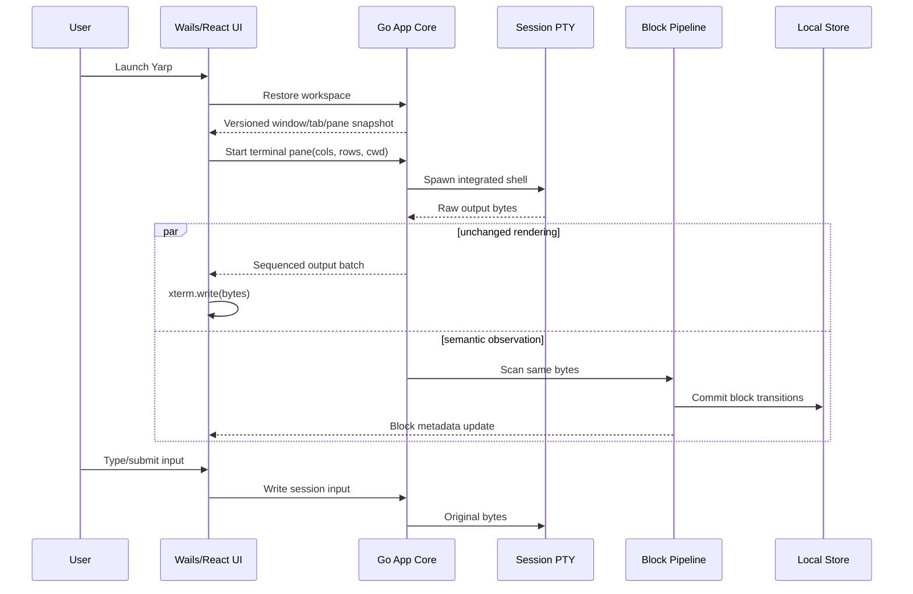

# Yarp desktop rewrite — technical design

## Context

The product contract is [PRODUCT.md](./PRODUCT.md). The current `master` implementation is a CLI/TUI PTY wrapper; it remains useful only as a source of small, tested primitives. The new desktop slice lives under `desktop/` and already proves the critical packaging path:

- `desktop/main.go:15-39` creates a Wails-owned native window with an inset macOS title bar and packaged frontend assets.
- `desktop/app.go:20-160` owns one real PTY session, streams byte-preserving output as base64 events, accepts input, resizes the PTY, and closes it with the application.
- `desktop/frontend/src/main.ts:103-225` embeds xterm.js, renders the Sandford shell, and connects terminal input/output to the Go process.
- `internal/termio/pty.go:11-28` already provides a small Unix PTY/Windows ConPTY interface.
- `internal/vt/scanner.go:65-169` can observe OSC 133/633/7 command metadata without modifying the byte stream.
- `internal/shellhook/shellhook.go:18-123` injects hooks for bash, zsh, fish, and PowerShell. It is useful starting material, but it is not assumed to be the final integration protocol.

The first packaged artifact is a self-signed `darwin/arm64` `Yarp.app` with the canonical portrait icon. It launches independently, creates a zsh PTY inside the app, accepts terminal focus, and resizes the PTY from the embedded renderer. This prototype intentionally stops before claiming tabs, splits, semantic blocks, persistence, or agents.

The legacy Rust client remains available through git history and local debug artifacts only as a visual and behavioral oracle. No production code depends on it.

## Proposed changes

### 1. Desktop foundation

Use stable Wails v2.13 as the desktop host and xterm.js 6 as the initial terminal viewport.

- Wails owns native windows, lifecycle, packaging, menus, dialogs, file-open events, platform options, and typed Go/TypeScript bindings.
- Go owns durable product state, processes, PTYs, shell integration, block metadata, persistence, search, workflows, provider adapters, and permission decisions.
- TypeScript owns presentation state, accessibility/focus behavior, pane layout rendering, command/editor interactions, and terminal viewport instances.
- macOS ships first. Platform seams remain explicit, but Linux and Windows work does not dilute the first coherent desktop release.
- Wails v3 is not used while it remains alpha. A future migration is allowed behind the desktop adapter.

The frontend will move from the current single-file prototype to React/TypeScript before the tab/pane slice. React is a presentation choice, not a state-authority choice; durable state stays in Go. The main component boundaries are:

```text
AppFrame
├── TitleBar
├── WorkspaceSidebar
├── TabStrip
├── PaneTree
│   ├── TerminalPane
│   │   ├── TerminalViewport
│   │   ├── BlockChromeLayer
│   │   └── CommandEditor
│   ├── AgentPane
│   ├── EditorPane
│   └── EvidencePane
├── CommandPalette
└── StatusBar
```

`TerminalViewport` is an internal interface rather than direct xterm calls spread through the UI. It owns write, input subscription, resize, focus, selection, markers/decorations, search, serialization for recovery, and disposal. xterm.js is the first implementation. This seam permits measured replacement with another renderer later without rewriting workspaces or blocks.

React component lifetime is not terminal lifetime. A frontend terminal registry keyed by stable pane ID owns each xterm instance, its DOM surface, session ID, output sequencing, resize observer, lifecycle snapshot, and explicit asynchronous destruction. A `TerminalPane` only attaches or detaches that persistent surface. When a split changes React ancestry, the same xterm DOM, screen contents, scrollback, and PTY session are reparented instead of being destroyed and restarted. A pane disappears from the workspace only after the Go session manager confirms that its process has stopped.

### 2. Repository and package shape

The Wails desktop target uses the root Go module; there is no nested application module. The intended ownership is:

```text
desktop/                         Wails entry point, packaged assets, frontend
desktop/frontend/src/           React application and renderer adapters
internal/appcore/               lifecycle and top-level command/query API
internal/session/               PTY session manager and bounded transports
internal/workspace/             windows, tabs, pane tree, focus, persistence DTOs
internal/terminal/              shell launch/integration and block observation
internal/blockstore/            durable semantic blocks and search index
internal/playbook/              user/project playbooks and argument resolution
internal/agentcore/              provider/tool/permission/case-file model
internal/storage/                SQLite connection, migrations, backup/recovery
```

Existing `internal/termio`, `internal/vt`, and shell-hook tests may be moved under these boundaries or replaced. Existing CLI commands can temporarily call the new core, but the desktop product is the primary acceptance surface. The old alternate-screen `internal/ui` package does not become part of the desktop architecture.

### 3. Session manager and PTY transport

Replace the prototype's single `App.session` pointer with a `SessionManager` keyed by opaque session IDs.

Each session owns:

- the PTY/process and its lifecycle;
- shell path, launch arguments, environment, initial/current directory, and pane owner;
- the output reader and block observer;
- a monotonic output sequence;
- a bounded queue of encoded output batches;
- exit status and explicit close/restart semantics;
- shell-hook cleanup resources.

The transport preserves PTY bytes exactly. Reads are coalesced up to 64 KiB or an 8 ms flush deadline, base64 encoded at the Wails boundary, and tagged with session ID and a contiguous data-batch sequence number. Exit and error event counters do not consume numbers in the data sequence. The frontend holds out-of-order batches until gaps arrive, ignores duplicates, and acknowledges the highest contiguous sequence only from xterm's completed write callback. A terminal exit carries the final data sequence, and the UI does not show the terminal as ended until that sequence has rendered. A session permits only a small bounded number of unacknowledged batches; backpressure pauses the PTY reader rather than allowing unbounded WebView memory growth. No output is dropped silently.

Input carries a session ID and UTF-8 string from xterm's `onData`. Resize carries a session ID, columns, rows, pixel width, and pixel height when available. Closing a pane follows an explicit policy: terminate, detach for later recovery, or cancel. Application shutdown drains durable state and then closes or deliberately preserves sessions according to that policy.

Application shortcuts use `Cmd` on macOS and equivalent application modifiers elsewhere. Terminal `Ctrl` sequences remain owned by the foreground program, satisfying PRODUCT behaviors 13–17.

### 4. Workspace, tabs, and pane tree

The durable workspace model is independent of React component instances:

```text
Workspace
  id, name, windows[], activeWindow, revision

WindowState
  id, frame, tabs[], activeTab

Tab
  id, title, color, rootPane, focusedPane, closedAt?

PaneNode = Leaf(Pane) | Split(axis, ratio, first, second)

Pane
  id, kind, resourceID, title, cwd, lifecycle
```

Pane mutations are commands applied in Go and returned as versioned snapshots or patches. Split ratios are clamped, focus is explicit, and every close/move/maximize operation is reversible when its underlying resource remains available. Frontend drag operations preview locally and commit one validated mutation. The tabs/splits vertical slice temporarily keeps the pane tree in frontend memory while the Go workspace authority is built; it is explicitly non-persistent and is not acceptance evidence for restart restoration.

Workspace snapshots are written transactionally. Recently closed items retain enough metadata to restore the surface without falsely claiming a dead process is still alive. Saved layouts use a documented, secret-free file format separate from live process state. These changes implement PRODUCT behaviors 6–12.

### 5. Semantic blocks

PTY output is always delivered unchanged to the terminal viewport and simultaneously observed by the block pipeline.

Shell integration emits open OSC 133 prompt/output/end boundaries, OSC 7 directory changes, and an encoded exact command line. The observer converts those events into a block state machine keyed by session:

```text
Prompt → Editing → Running → Completed | Failed | Cancelled | Truncated
                         ↘ FullScreen/AltBuffer → Running
```

The Go block record is canonical. xterm markers/decorations provide quiet inline status rails, hover targets, and navigation anchors without creating one terminal emulator per command. Rich evidence that cannot fit safely inside terminal cells renders in an anchored DOM layer or inspector tied to the canonical block ID.

The first block slice records exact command, raw transcript segments, normalized searchable text, CWD, timing, and exit status. Later migrations add repository/branch, bookmarks, filters, rich artifacts, and agent relationships. Raw data and normalized search text remain distinct so visual fidelity is not sacrificed for indexing.

The viewport's scrollback is not the database. Reload and cross-session search use `BlockStore`; xterm internals are never serialized as the durable format. This implements PRODUCT behaviors 18–24.

### 6. Command editor

The command editor is a first-party editor rendered below the active waterfall, not an invisible textarea inside the terminal renderer. It owns multiline text, selection, undo/redo, submit, history traversal, completion presentation, playbook arguments, slash commands, and context attachments.

During normal shell editing, the editor and shell line discipline require an explicit synchronization contract. The implementation will prototype two modes before locking the final design:

1. shell-owned editing with Yarp mirroring input and suggestions; or
2. Yarp-owned editing that sends a complete accepted command to a minimal shell prompt.

The choice must be validated against zsh/bash/fish/PowerShell configuration, Ctrl-C/Ctrl-D, bracketed paste, password prompts, REPLs, and nested interactive programs. Yarp-owned input must automatically yield to the terminal whenever the foreground process is not the integrated shell prompt. This prevents the global-hotkey failure of the discarded wrapper.

### 7. Storage and migration

Use SQLite in WAL mode for workspace metadata, blocks, case files, evidence relations, and full-text search. Store large binary artifacts and raw transcript chunks as content-addressed files under `~/.yarp`, referenced from SQLite. User-editable settings, themes, keybindings, personas, and playbooks remain documented text files.

Storage requirements:

- numbered forward migrations with transactional application;
- a compatibility/version check before any write;
- automatic recoverable backup before destructive migration;
- crash-safe commits and integrity checks;
- no OAuth grants, provider secrets, or keychain material in ordinary history backups;
- explicit private-mode state that prevents durable block/output writes;
- importers, never implicit reinterpretation, for old Rust or discarded-Go data.

The SQLite driver will be selected by a small packaging/FTS/concurrency spike before storage implementation. The driver is not allowed to make macOS signing or later Windows packaging fragile.

### 8. Playbooks and local configuration

Playbooks have one canonical schema shared by user and project files. A loader reports every invalid file with its path and preserves unknown fields for forward compatibility where possible. Multi-document files, arguments, choices, defaults, validation, shell eligibility, aliases, environment overlays, and project scope are covered explicitly.

File watchers debounce changes and publish versioned configuration snapshots. UI edits use atomic file writes. The UI never silently hides malformed local configuration. This implements PRODUCT behaviors 30–34.

### 9. Agent and case-file architecture

Agents are provider adapters behind a local case-file engine, not a monolithic chat client. The case file owns messages, evidence references, tool requests/results, approvals, child tasks, diffs, and final synthesis. Provider adapters translate this model to local CLIs, local model servers, or explicitly configured remote providers.

Every tool declares its required capability and proposed scope. A permission engine resolves the visible session policy before execution. Shell and file tools publish the same block/evidence records as human actions. Agent concurrency is represented as a task graph with explicit ownership and handoffs; the UI never hides tool execution behind a single streaming bubble.

This layer follows only after terminal blocks, workspaces, persistence, and the editor are dependable. It implements PRODUCT behaviors 35–40.

### 10. Visual system and assets

The canonical portrait assets and fork-authored themes are reused. Sandford dark uses background `#0E1A2E`, foreground `#F5EFD8`, and red accent `#9F2A2A`; Greater Good light uses `#F5E6C8`, `#2A1F14`, and the same red accent. Derived surfaces use controlled foreground overlays rather than unrelated hard-coded palettes.

The portrait appears in the app icon and a few identity-bearing states. Sandford terminology remains contextual and sparse. Generic inherited Warp/provider artwork is excluded even when filenames were previously renamed to Yarp.

## End-to-end flow



## Testing and validation

### Automated

- Go unit tests use fake PTYs to cover multi-session lifecycle, contiguous data ordering, bounded backpressure, resize coalescing, exit/drain races, authoritative shutdown, and orphan prevention (PRODUCT 13–17, 45).
- Existing PTY and OSC scanner tests are retained or strengthened for split byte sequences, Unicode, malformed controls, alternate screen, and shell-specific events (13–24).
- Workspace property tests generate pane trees and verify split/move/close/maximize/reopen operations preserve valid topology and focus (6–12).
- Storage tests kill writers at migration and transaction boundaries, reopen the database, verify integrity, and test newer-version refusal and backup restore (11, 23, 34, 40–46).
- Frontend tests cover pane-tree topology, controller preservation across React reparenting, gap/duplicate output handling, post-render acknowledgements, keyboard/spatial focus, accessible split resizing, tab/pane commands, non-color statuses, palette dismissal, editor preservation, and permission dialogs (7–9, 13–17, 20, 27–29, 36, 44).
- Playbook fixtures include legacy multi-document files, invalid files, argument choices, shell filters, unknown fields, project overrides, and atomic UI edits (30–34).
- Provider/tool contract tests use fake agents and assert evidence, permission scope, cancellation, child-task ownership, and failure visibility (35–40).

### Packaged-app gates

Each product slice is exercised in the packaged `Yarp.app`, not only a browser or CLI:

1. Launch from Finder and confirm no Terminal.app process or account/network dependency is involved (1–5).
2. Drive zsh, bash, fish, and PowerShell where available through real PTYs; verify commands, output, CWD, exit state, and blocks.
3. Run Unicode/emoji, bracketed paste, mouse reporting, vim, less, tmux, SSH, alternate-screen transitions, resize, selection, copy/paste, and IME scenarios (13–17).
4. Create tabs and both split directions, move focus, maximize, close/reopen, restart Yarp, and compare restored layout/state (6–12).
5. Generate sustained and burst output while resizing and switching panes; compare a byte checksum before observation/rendering and verify bounded memory (15–16).
6. Capture screenshots for Sandford dark, Greater Good light, running/success/failure blocks, focus states, palette, editor, approval, private mode, and recovery states (3–5, 18–29, 41–47).

The current first-slice artifact satisfies only the initial portions of gates 1 and 3: a real packaged window, embedded zsh PTY, live renderer, focus, and resize. It is explicitly not evidence for later behaviors.

## Risks and mitigations

- **WebView transport saturation:** bounded sequenced batches and acknowledgements apply backpressure; stress gates compare output checksums.
- **xterm decoration limits:** keep Go blocks canonical and isolate viewport APIs; use anchored DOM/inspector for rich content instead of one xterm per block.
- **WKWebView platform variance:** macOS is the first quality target; Linux/Windows ship only after their renderer/IME matrices pass.
- **Input ownership conflicts:** application shortcuts never steal terminal control bytes; the command-editor prototype must prove safe prompt detection before replacing shell-owned editing.
- **Scope drift:** numbered PRODUCT behaviors are the acceptance contract. Dropping a weak feature is allowed only by updating that contract explicitly, never by silently narrowing the implementation spec.
- **Legacy baggage:** old Rust code and the discarded wrapper are reference material, not architectural constraints.

## Parallelization

After the foundation lands, work splits along stable contracts:

- session manager and bounded PTY transport;
- React app frame, tab strip, and pane tree;
- shell integration and block state machine;
- SQLite schema/migrations/search;
- canonical visual assets and accessibility tokens;
- packaged-app automation and terminal-fidelity fixtures.

Agent, editor, playbook, and richer evidence work begins after these contracts are integrated rather than in parallel with foundational churn.
